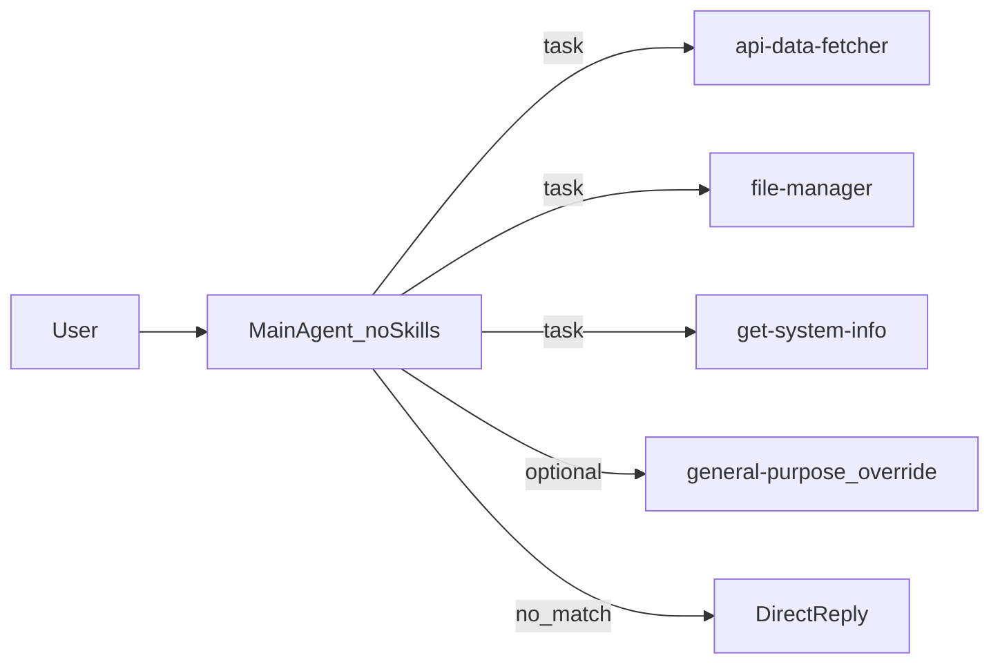

# 多 Agent 架构改造计划

## 核心约束（摘要）

| 项目              | 约定                                                                      |
| --------------- | ----------------------------------------------------------------------- |
| 主代理 `skills`    | **不传**（无 SkillsMiddleware，无 SKILL 加载）                                   |
| 子代理 `skills`    | 各一条虚拟路径，仅含**一个**技能目录（见下表）                                               |
| 后端              | `LocalShellBackend(root_dir=".", virtual_mode=True, env=...)`           |
| 持久化             | `InMemorySaver()` + `configurable.thread_id`                            |
| 委派              | 内置 `task(name=..., task=...)`；无合适子代理时主代理**直接回答**，不强行 `task`             |
| general-purpose | **显式覆盖** `name="general-purpose"`，不传 `skills`，description 约束少用、避免抢主代理自答 |

## 现状与目标

- **现状**：`[my_agent.py](d:\PythonProject\sandbox_demo\my_agent.py)` 使用 `skills=[./teaching_skills]`，主代理加载全部技能。
- **目标**：主代理只做意图识别与分配；三子代理各持一 skill；无匹配时主代理自答。

技能目录（`SKILL.md` 的 `name` 与文件夹一致）：

- `[teaching_skills/api-data-fetcher/](d:\PythonProject\sandbox_demo\teaching_skills\api-data-fetcher\SKILL.md)`
- `[teaching_skills/file-manager/](d:\PythonProject\sandbox_demo\teaching_skills\file-manager\SKILL.md)`
- `[teaching_skills/get-system-info/](d:\PythonProject\sandbox_demo\teaching_skills\get-system-info\SKILL.md)`

## 官方机制（与实现对齐）

- **主代理无 skills**：不传 `skills` 则主图不注入 `SkillsMiddleware`；子代理通过各自 `skills` 独立加载（见 [Subagents](https://docs.langchain.com/oss/python/deepagents/subagents)）。
- **子代理列表**：`create_deep_agent(..., subagents=[dict, ...])`，字典含 `name`、`description`、`system_prompt`；可选 `skills`（POSIX 虚拟路径）。
- **虚拟路径**：`LocalShellBackend` + `virtual_mode=True` 时，使用 `/teaching_skills/<子目录>/` 形式（见 [Customization / Skills](https://docs.langchain.com/oss/python/deepagents/customization#skills)）。
- **内置工具**：`write_todos`、文件工具、`execute`（本机 shell）、`task`；子代理未显式写 `tools` 时与主调用一致（默认无额外自定义 tools），文件与 execute 由中间件提供。
- **Checkpoint**：`[InMemorySaver](https://docs.langchain.com/oss/python/langgraph/persistence)` 与 `thread_id` 与现有一致。

## 架构示意

## 实现要点

### 1. 主代理

- 调用 `create_deep_agent(model=..., backend=..., checkpointer=..., subagents=..., system_prompt=...)`，**不包含 `skills` 关键字**。
- **system_prompt（中文）**：列出三子代理的 `name` 与适用场景（与各 `SKILL.md` 的 `description` 一致）；说明闲聊/非三领域问题**不调用 `task`**；委派时 `task` 内写清用户诉求与上下文。
- **backend / checkpointer**：保留现有 `LocalShellBackend`（含 `PATH`、`PYTHONPATH`、`SYSTEMROOT` 等）与 `InMemorySaver()`。

### 2. 三子代理（字典）

`name` 建议与目录名一致（便于排查），与主 prompt 一致；`description` 可直接用或略写自对应 `SKILL.md` frontmatter。

| name               | skills                                   |
| ------------------ | ---------------------------------------- |
| `api-data-fetcher` | `["/teaching_skills/api-data-fetcher/"]` |
| `file-manager`     | `["/teaching_skills/file-manager/"]`     |
| `get-system-info`  | `["/teaching_skills/get-system-info/"]`  |

- **system_prompt**：强制按该目录 `SKILL.md` 执行；可提示通过 `execute` 在项目根运行脚本（与现有 skill 文本一致）。
- **model**：省略则与主代理共用同一 `ChatOpenAI` 实例。

### 3. `general-purpose` 覆盖

- 在 `subagents` 中增加 `name="general-purpose"` 的 dict，**不传 `skills`**；`description` 写明：仅当需要隔离长链路上下文且三专家不适用时再用；一般问答与三领域外问题由主代理直接回答。
- `system_prompt` 需合法（可简短），因自定义 subagent 要求定义（见官方 Subagents 表）。

### 4. 流式交互

- 保留 `agent.stream(..., stream_mode="messages")` 与 `thread_id`。
- Stream 后若存在对同一轮 `ainvoke` 再写 user+assistant，可能重复入库；实施时验证后**删除或改为单次流式消费**（以行为正确为准）。

### 5. 代码组织

- 单文件 `[my_agent.py](d:\PythonProject\sandbox_demo\my_agent.py)`：`build_local_shell_backend()`、`build_teaching_subagents()`、`create_agent_graph()`（或等价命名），常量集中；风格与现有文件一致。

### 6. 文档修正（推荐）

- `[get-system-info/SKILL.md](d:\PythonProject\sandbox_demo\teaching_skills\get-system-info\SKILL.md)` 将错误路径 `windows-system-info` 改为 `get-system-info`。

## 实施顺序

1. 实现 backend + checkpointer + 三子代理 + general-purpose 覆盖 + 主无 `skills`。
2. 写主/子 system_prompt 与 description。
3. 跑通流式对话；检查 checkpoint 与是否双写消息。
4. 修正 `get-system-info` 文档路径（可选）。

## 验收

- 三类领域问题能触发对应 `task(name=...)`。
- 非三领域常识/闲聊由主代理直接文本回答，不滥用 `general-purpose`。
- 子代理侧仅加载对应目录 skill（可通过 trace 或日志观察 `task` 目标名）。

## 参考

- [Deep Agents overview](https://docs.langchain.com/oss/python/deepagents/overview)
- [Customize Deep Agents](https://docs.langchain.com/oss/python/deepagents/customization)
- [Subagents](https://docs.langchain.com/oss/python/deepagents/subagents)

