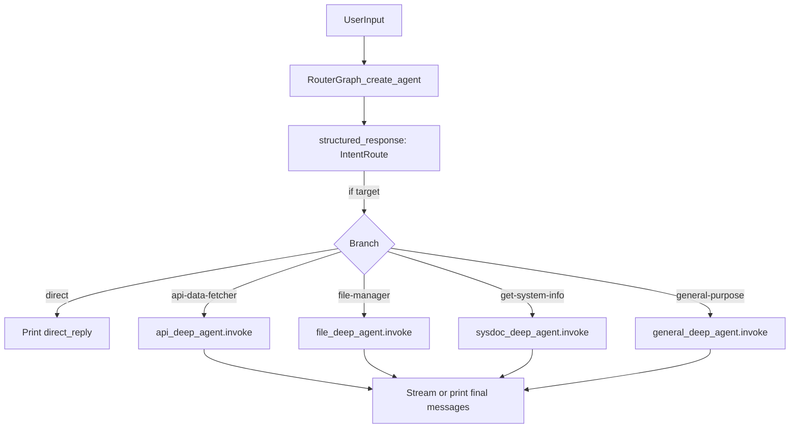

# 多独立 Agent 路由重构

## 目标架构

- **主路由**：`[create_agent](langchain.agents)`（`[my_agent.py](e:/pycharm/pythonProject/sandbox_demo/my_agent.py)` 中从 `langchain.agents` 导入），**不传 skills**，`tools=[]` 或 `None`，`response_format` 为 Pydantic 模型（见下）。
- **子专家**：各一个 `create_deep_agent(model=llm, backend=..., skills=[...], system_prompt=..., checkpointer=...)`，**不再使用 `subagents` 参数**；skills 路径与当前 `[build_teaching_subagents()](e:/pycharm/pythonProject/sandbox_demo/my_agent.py)` / `general-purpose` 保持一致（api、file-manager、get-system-info 含 docx/pdf/pptx/xlsx、general 无 skills）。
- **编排**：对 `invoke` 返回的 `state["structured_response"]`（LangChain 1.x 在 `AgentState` 中定义，见 `langchain.agents.middleware.types.AgentState`）做 `if/elif`，把 `delegated_task` 作为新 `HumanMessage` 交给对应 `CompiledStateGraph.invoke`。

## 结构化输出模型（Pydantic）

建议定义 `IntentRoute`（名称可调整）：

- `target`: `Literal["direct", "api-data-fetcher", "file-manager", "get-system-info", "general-purpose"]`
- `delegated_task`: `str` — 委派给子 agent 时的完整任务说明（含路径、约束）；`direct` 时可为空或简述。
- `direct_reply`: `str | None` — **仅当 `target == "direct"` 时必填**（你选的单次结构化输出），直接展示给用户。

路由 `system_prompt`：沿用当前 `[MAIN_ROUTER_SYSTEM_PROMPT](e:/pycharm/pythonProject/sandbox_demo/my_agent.py)` 的意图边界，并明确要求：**只输出符合上述 schema 的结构化结果**；`direct` 时必须在 `direct_reply` 中给出完整中文回答。

## 实现要点

1. **工厂函数**（可仍在 `my_agent.py` 或拆成 `agents/router.py`、`agents/specialists.py`）
  - `build_router_agent(checkpointer)` → `create_agent(..., response_format=IntentRoute, checkpointer=checkpointer)`  
  - `build_api_agent(backend, checkpointer)` 等 5 个 `create_deep_agent` 封装，复用现有 `build_local_shell_backend` 与 `llm`。
2. **编排入口** `run_turn(user_input: str, config)`
  - `router_state = router.invoke({"messages": [HumanMessage(user_input)]}, config)`  
  - `route = router_state["structured_response"]`（若缺失则回退错误处理）  
  - `if route.target == "direct":` 输出 `route.direct_reply`  
  - `elif route.target == "api-data-fetcher":` `api_agent.invoke({"messages": [HumanMessage(route.delegated_task)]}, config)` … 其余分支类推  
  - 从子 agent 最终 `messages` 取最后一条 `AIMessage.content` 作为助手回复（与现有流式打印逻辑对齐）。
3. **流式交互**（`[stream_agent_interaction_corrected](e:/pycharm/pythonProject/sandbox_demo/my_agent.py)`）
  - 第一轮：路由可用 `invoke`（结构化一次完成）；若需流式，可对 router 使用 `astream_events` 或仅对**子 agent** 保留现有 `stream_mode="messages"`。  
  - 委派后：对选中的 `deep_agent` 做 `stream`，与当前体验一致。
4. **清理**
  - 删除文件末尾误写的 `[create_agent()](e:/pycharm/pythonProject/sandbox_demo/my_agent.py)` 单行调用（`if __name__` 下当前为无效/残留代码）。  
  - 移除或注释原 `create_agent_graph` 中的 `subagents` 聚合逻辑。
5. **校验**
  - 本地运行一次 `python my_agent.py`：分别输入「查天气」「列目录」「系统信息」「闲聊」验证 `target` 与分支行为。  
  - 确认 `structured_response` 类型与 `invoke` 输出键名（与当前 LangChain 1.2.10 一致）。

## 风险与注意

- **空 `tools`**：若 `create_agent(..., tools=[])` 在个别版本报错，可改为 `tools=None`（以签名为准）。  
- **温度**：路由建议 `temperature=0` 或较低，保证分类稳定；可与主 `llm` 拆成两个 `ChatOpenAI` 实例。  
- **线程 ID**：路由与子图可共用同一 `InMemorySaver` + `thread_id`，若出现状态串扰，可为子 agent 使用 `thread_id` 后缀（如 `f"{tid}_api"`）。

