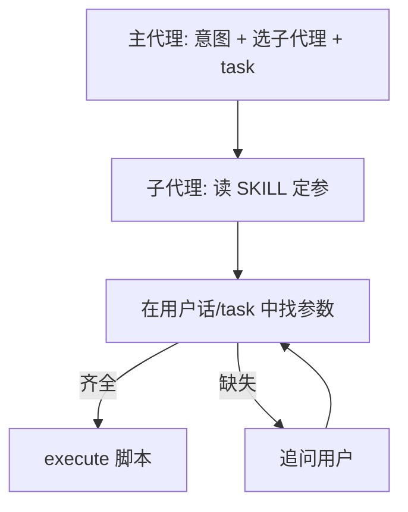

# 子代理参数抽取与追问（意图侧，不改脚本匹配）

## 目标行为（你确认的流程）

1. **主代理**：识别用户意图，**确定交给哪个子代理**，通过 `task` 委派。
2. **子代理**（接到任务后）：
  - **先**根据本技能（SKILL.md / 脚本用法）判断**需要哪些参数**（例如天气需 `--city`）；
  - **再在用户提问**（以及主代理 `task` 里附带的需求描述）**中查找**这些参数；
  - **找到了**：用这些参数 `execute` 脚本；
  - **没找到**：**向用户提问**补全参数，**不要**用错误默认值硬跑。

## 与「上海天气」问题的关系

`[fetch_api_data.py](d:\PythonProject\sandbox_demo\teaching_skills\api-data-fetcher\fetch_api_data.py)` 中上海分支仍依赖 `city` 含「上海」或 `shanghai`。**不在此计划内**改脚本内匹配。通过上述流程，子代理应在执行前确保 `--city` 与用户说的城市一致；若用户只说「天气」未说城市，应**追问城市**而不是猜广州/上海。

## 实施要点（仅提示词与 SKILL，不用正则改 Python）

### 1. 主代理 `[my_agent.py](d:\PythonProject\sandbox_demo\my_agent.py)`

- `**MAIN_ROUTER_SYSTEM_PROMPT`**：明确分工——主代理不负责替子代理凑齐脚本参数；委派时 `task` 内应包含**用户原话或完整需求**，便于子代理抽参（避免主代理过度摘要导致丢「上海」等城市名）。

### 2. 各子代理 `system_prompt`（同一文件 `build_teaching_subagents()`）

- **api-data-fetcher**：写清固定步骤——读 SKILL → 列出当前能力所需 CLI 参数（如 `weather` 需 `city`）→ 从用户与 task 文本中提取 → 齐则 `execute`，缺则**一条明确追问**（例如「请告诉我要查哪个城市的天气」）。
- **file-manager / get-system-info**（简要同结构）：先定参（路径、关键词等）→ 从用户话里找 → 缺则问。

### 3. `[api-data-fetcher/SKILL.md](d:\PythonProject\sandbox_demo\teaching_skills\api-data-fetcher\SKILL.md)`

- 按 **api-type** 列出**必填参数**（天气：`--city`；汇率：`--base-currency` 等），与子代理「先定参再执行」一致；可保留/补充上海、广州等**示例命令**作为参考，**不**要求改 `fetch_api_data.py`。

## 验收建议

- 「上海天气」：子代理应能从用户话中取到城市并带 `--city 上海`（或 `Shanghai`）执行，无需主代理额外锁参。
- 「天气怎么样」：无城市时应**追问**，不应用错误城市跑脚本。

## 不在此计划内

- 修改 `get_weather` 或增加正则匹配（你已排除）。
- 改 `skill_scoped_backend` 路由逻辑。

