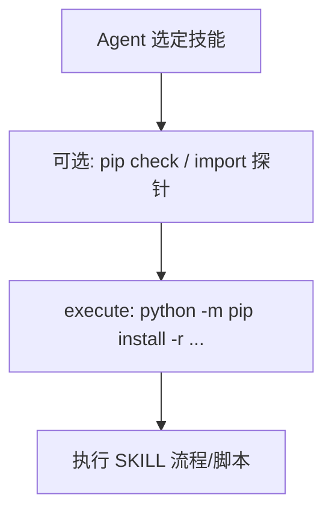

# 技能依赖与 Shell 自动安装计划

## 背景

- 当前 `[teaching_skills](e:/pycharm/pythonProject/sandbox_demo/teaching_skills)` 下**没有**统一的依赖清单；依赖散落在各 `[SKILL.md](e:/pycharm/pythonProject/sandbox_demo/teaching_skills/pdf/SKILL.md)` 正文中（如 `# Requires: pip install ...`），编辑器标红与 agent 行为都难以统一。
- 你已选择：**每个技能目录单独维护** `requirements.txt`（pip），必要时再加 `package.json`（npm，用于 docx/pptx 等）。

## 目标行为

- Agent 在**首次使用某技能**或**执行 import/脚本失败**时，用 **shell（execute）** 安装该技能目录下的依赖，再继续任务。
- 使用**当前项目 Python**（与 `[my_agent.py](e:/pycharm/pythonProject/sandbox_demo/my_agent.py)` 中 `get_python_executable()` / `LocalShellBackend` 的 `PATH` 一致），推荐命令形态：`python -m pip install -r teaching_skills/<skill>/requirements.txt`（Windows 下避免裸 `pip` 指向错误解释器）。

## 文件与内容设计

1. **为每个技能子目录新增 `requirements.txt`**
  - 路径示例：`[teaching_skills/pdf/requirements.txt](e:/pycharm/pythonProject/sandbox_demo/teaching_skills/pdf/requirements.txt)`、`[teaching_skills/xlsx/requirements.txt](e:/pycharm/pythonProject/sandbox_demo/teaching_skills/xlsx/requirements.txt)` 等。
  - 内容从现有 `SKILL.md` 与脚本 `import` 归纳（如 `pypdf`、`pandas`、`openpyxl`、`python-docx`、`Pillow`、`pytesseract`、`pdf2image` 等按技能拆分，避免一个技能装全库）。
  - `[teaching_skills/api-data-fetcher](e:/pycharm/pythonProject/sandbox_demo/teaching_skills/api-data-fetcher)` 若脚本有独立依赖，同样单独列出。
2. **需要 Node 的技能（如 docx/pptx 文档中已有 `npm install`）**
  - 在对应目录增加 `package.json`（最小字段：`name`、`private`、`dependencies`），或在 `SKILL.md` 旁增加 `package.json` 仅列出 `docx`、`pptxgenjs` 等。
  - System prompt 中写明：若任务需要 JS 工具链，先 `cd` 到该技能目录再 `npm install`（或 `npm ci`），再执行文档中的命令。
3. **（可选但推荐）根目录或 `teaching_skills/` 下增加 `ensure_skill_deps.py`**
  - 入参：技能名或目录名，例如 `python teaching_skills/ensure_skill_deps.py pdf`。
  - 行为：对应该目录执行 `subprocess` 调用 `sys.executable -m pip install -r ...`（失败返回非 0），减少 agent 拼写路径错误。
  - Agent 优先：先 `execute` 该脚本，失败再回退到手写 `pip`。

## 修改 Agent 行为（`my_agent.py`）

- 在 `**GET_SYSTEM_INFO_SYSTEM**`（以及若适用，`**API_DATA_FETCHER_SYSTEM**` / `**GENERAL_PURPOSE_SYSTEM**`）中增加一段**固定流程**（与现有「Windows、禁止伪造二进制」等约束并列）：
  - 执行某技能前，若尚未安装依赖：用 `execute` 运行 `python -m pip install -r teaching_skills/<skill>/requirements.txt`（对该轮实际用到的技能）。
  - 若 `pip` 报错，根据 `ModuleNotFoundError` / 脚本输出补装缺失包或重试一次。
  - 若需 npm：在对应 `package.json` 所在目录执行 `npm install`。
- **可选**环境变量：`AGENT_ALLOW_PIP_INSTALL`（默认 `1`）为 `0` 时仅提示用户手动安装、不执行 pip（便于受限环境）。

## 验收

- 新环境（最小 venv）下，仅依赖 `requirements.txt` 能跑通各技能文档中的**最小 Python 示例**（或项目内已有脚本）。
- Agent 在模拟「未安装 pypdf」场景下，会先执行安装命令再继续，不再直接报 `ModuleNotFoundError` 放弃。

## 不纳入本计划

- 全量自动扫描每个 `SKILL.md` 代码块并生成 `requirements.txt`（工作量大且易错）；采用**按技能目录手工维护 + 从 SKILL 归纳**即可迭代。

